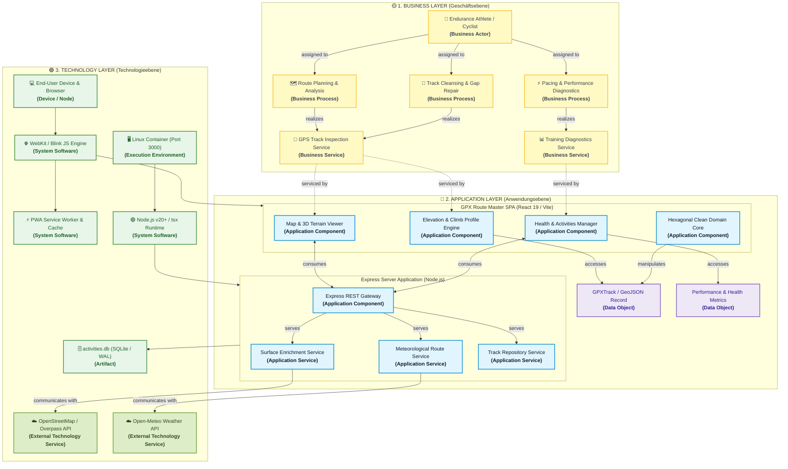
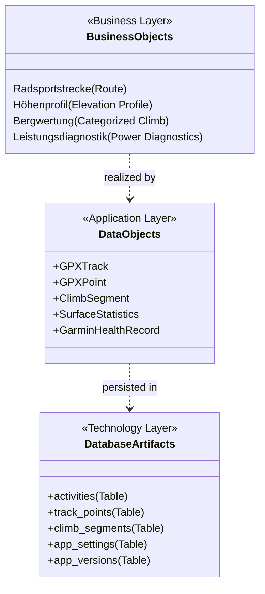
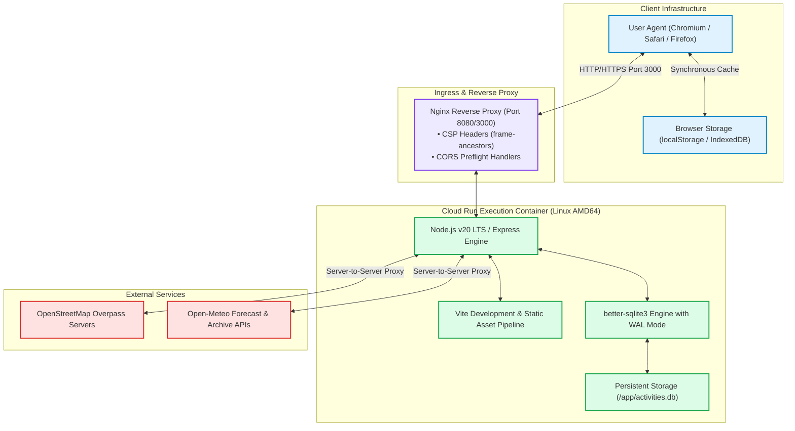
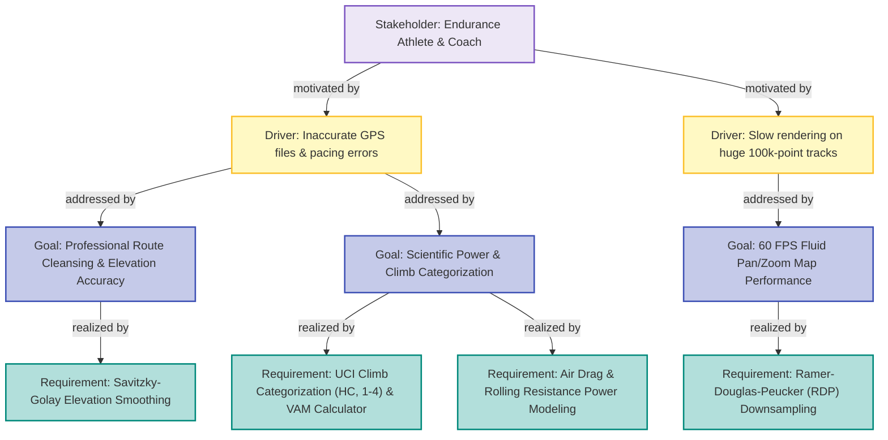

# GPX Route Master — ArchiMate 3.1 Architecture Specification

This document specifies the enterprise, system, and solution architecture of **GPX Route Master** according to the **The Open Group ArchiMate® 3.1 Standard**.

The architecture adheres to Clean Architecture / Hexagonal Architecture principles, decoupling domain and calculation engines from framework and infrastructural concerns.

---

## 1. ArchiMate Standard Color Conventions

In accordance with the official ArchiMate 3.1 standard visualization scheme, elements are categorized into distinct conceptual layers:

| Layer | Color Code | Standard Hex | Role & Description |
| :--- | :--- | :--- | :--- |
| **Strategy & Motivation** | Light Violet / Lilac | `#EDE7F6` / `#7E57C2` | Stakeholders, Drivers, Goals, Capabilities, and Requirements |
| **Business Layer** | Warm Yellow / Gold | `#FFF9C4` / `#FBC02D` | Business Actors, Roles, Processes, Services, and Business Objects |
| **Application Layer** | Cool Sky Blue | `#E1F5FE` / `#0288D1` | Application Components, Interfaces, Services, and Data Objects |
| **Technology Layer** | Mint / Leaf Green | `#E8F5E9` / `#388E3C` | Nodes, System Software, Execution Environments, and Artifacts |
| **Physical & External** | Soft Neutral Green | `#DCEDC8` / `#689F38` | Sensors, Devices, and External Third-Party APIs |
| **Implementation** | Peach / Warm Coral | `#FFE0B2` / `#FB8C00` | Work Packages, Deliverables, and Migration Plateaus |

---

## 2. Layered Architecture Viewpoint (Multi-Layer Overview)

The Layered Viewpoint connects the **Business Layer** (User goals & athletic analysis), the **Application Layer** (Hexagonal Domain, Frontend Components & Backend Services), and the **Technology Layer** (Container, Browser, SQLite, External APIs).

---

## 3. Application Cooperation Viewpoint (Hexagonal Architecture)

The application adheres to **Hexagonal (Ports & Adapters)** principles:
- **Domain Core**: Pure mathematical calculations, physics formulas (aerodynamic drag, rolling resistance), Savitzky-Golay filtering, Haversine metrics, and UCI climb category formulas.
- **Inbound Ports / Use Cases**: High-level orchestrators (`HydrateTrackUseCase`, `AnalyzeClimbsUseCase`, `SplitTrackOnGapsUseCase`).
- **Outbound Ports**: Abstractions for persistence and telemetry (`ITrackRepository`, `IWeatherService`).
- **Adapters**: REST controllers, Leaflet/MapLibre UI components, and SQLite implementations.

```mermaid
flowchart LR
    classDef domain fill:#FFE082,stroke:#FFA000,stroke-width:2px,color:#3E2723;
    classDef port fill:#FFF59D,stroke:#FBC02D,stroke-width:2px,color:#263238;
    classDef adapter fill:#BBDEFB,stroke:#1976D2,stroke-width:2px,color:#0D47A1;
    classDef infra fill:#C8E6C9,stroke:#388E3C,stroke-width:2px,color:#1B5E20;

    subgraph AdaptersPrimary ["Primary Adapters (Driving UI)"]
        UI_Map["Map.tsx (Leaflet/MapLibre)"]:::adapter
        UI_Elev["ElevationProfile.tsx (SVG)"]:::adapter
        UI_Sidebar["Sidebar.tsx (Controls)"]:::adapter
    end

    subgraph Hexagon ["Hexagonal Application Core"]
        subgraph InboundPorts ["Inbound Ports (API)"]
            P_InTrack["TrackManagementPort"]:::port
            P_InClimb["ClimbAnalysisPort"]:::port
            P_InGap["GapDetectionPort"]:::port
        end

        subgraph DomainCore ["Pure Domain Layer"]
            D_Track["Track & Point Entities"]:::domain
            D_Physics["Aerodynamic Power Engine"]:::domain
            D_Filter["Savitzky-Golay Filter"]:::domain
            D_UCI["UCI Climb Score Algorithm"]:::domain
        end

        subgraph OutboundPorts ["Outbound Ports (SPI)"]
            P_OutRepo["ITrackRepository"]:::port
            P_OutWeather["IWeatherService"]:::port
        end
    end

    subgraph AdaptersSecondary ["Secondary Adapters (Driven Infra)"]
        Infra_SQLite["SQLiteTrackRepository<br>(better-sqlite3)"]:::infra
        Infra_OpenMeteo["OpenMeteoWeatherService<br>(REST Client)"]:::infra
        Infra_Overpass["OverpassSurfaceAdapter<br>(OSM API)"]:::infra
    end

    AdaptersPrimary -->|invokes| InboundPorts
    InboundPorts --> DomainCore
    DomainCore --> OutboundPorts
    OutboundPorts --> AdaptersSecondary
```

---

## 4. Information Structure Viewpoint

This viewpoint maps conceptual **Business Objects** down to software **Data Objects** and physical database **Artifacts**.

### Key Data Attributes Mapping

| Data Object | Entity Attributes | Schema Realization |
| :--- | :--- | :--- |
| **`GPXTrack`** | `id`, `name`, `distance_km`, `ascent_m`, `descent_m`, `moving_time`, `surface_stats` | `activities` table & JSON fields |
| **`GPXPoint`** | `lat`, `lng`, `ele`, `time`, `hr`, `cadence`, `power`, `temp`, `speed_kmh`, `grade_pct` | In-memory point array / `points_json` |
| **`ClimbSegment`**| `id`, `start_dist`, `end_dist`, `length_km`, `avg_grade`, `gain_m`, `uci_score`, `category` (HC/1-4) | `climb_segments` table |
| **`AppSettings`** | `theme_mode`, `power_ftp`, `user_weight`, `user_age`, `user_max_hr`, `velo_text_markers` | `app_settings` key-value store |

---

## 5. Technology & Infrastructure Viewpoint

This viewpoint specifies the deployment environment, container runtime, network gateways, and security controls.

---

## 6. Motivation & Strategy Viewpoint

The motivation viewpoint traces functional requirements and software quality attributes back to overarching stakeholder goals.

---

## 7. ArchiMate Element Catalogue

| Element Name | ArchiMate Element Type | Layer | Architectural Realization |
| :--- | :--- | :--- | :--- |
| **Endurance Athlete** | Business Actor | Business | End-user using browser interface |
| **Route Planning** | Business Process | Business | GPX editing, multi-track workspace |
| **Track Inspection** | Business Service | Business | Instant elevation, distance, and surface analysis |
| **Map & 3D Terrain Viewer** | Application Component | Application | Leaflet & MapLibre GL 3D integration |
| **Elevation Profile Engine** | Application Component | Application | Two-layer SVG & HTML typography overlay |
| **Hexagonal Domain Core** | Application Component | Application | `domain/entities`, `physics`, `telemetry` |
| **Track Repository Service** | Application Service | Application | `infrastructure/repositories/sqliteTrackRepository` |
| **REST API Gateway** | Application Interface | Application | `server.ts` Express routing layer |
| **GPXTrack Data Object** | Data Object | Application | TypeScript interface `GPXTrack` |
| **Node.js Execution Node** | Execution Environment | Technology | Cloud Run Linux container |
| **SQLite Database** | Artifact | Technology | `better-sqlite3` file `/app/activities.db` |
| **Overpass OSM Service** | Technology Service | External | Remote OpenStreetMap data queries |
| **Open-Meteo Weather** | Technology Service | External | Route weather & wind forecasting |
