# GPX Route Master — System Architecture & Performance Overview

This document provides a comprehensive architectural breakdown of **GPX Route Master**, including data flow, performance optimizations, multi-layer rendering pipeline, and database persistence schemas.

---

## 1. High-Level Component & System Architecture

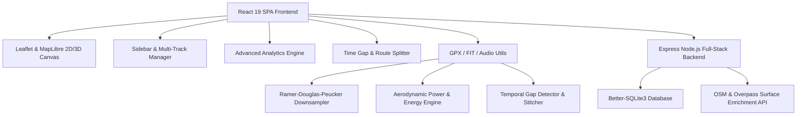

---

## 2. High-Performance Downsampling & Rendering Pipeline

To maintain **60 FPS pan and zoom performance** when handling GPX files with over 50,000 GPS track points, GPX Route Master employs a multi-tiered spatial downsampling pipeline using the **Ramer-Douglas-Peucker (RDP)** algorithm.

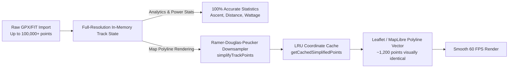

---

## 3. Asynchronous File Parsing & Time-Gap Processing Lifecycle

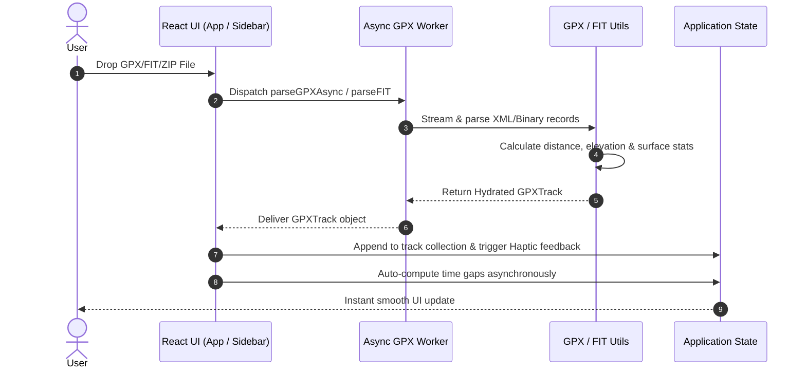

---

## 4. Local SQLite Database Entity-Relationship Diagram

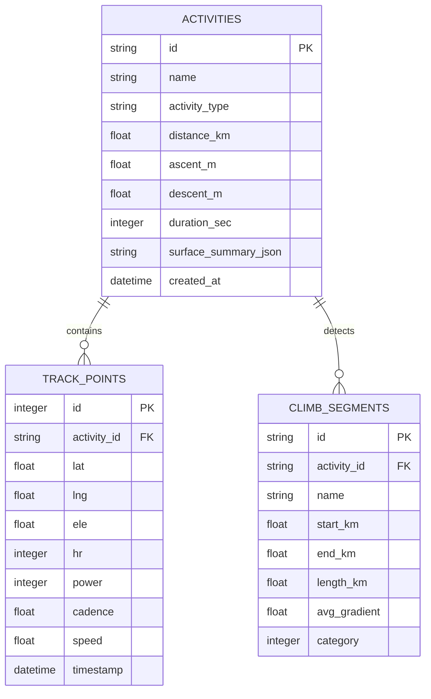

---

## 5. Architectural Performance Strategies Implemented

| Optimization Strategy | Implementation Details | Impact / Metric |
| :--- | :--- | :--- |
| **Ramer-Douglas-Peucker (RDP) Downsampling** | `simplifyTrackPoints()` & `getCachedSimplifiedPoints()` | Reduces map DOM vector nodes by **up to 90%** for 60 FPS map panning. |
| **LRU Coordinate Caching** | Internal 50-item Map cache keyed by track ID & point length | Eliminates redundant RDP recalculations across frame re-renders. |
| **Asynchronous Worker Offloading** | `utils/gpxWorker.ts` | Prevents UI thread lockups during multi-megabyte FIT/GPX file imports. |
| **React 19 Memoization** | `React.useMemo` on time-gap detection, elevation profiles, and power stats | Zero unnecessary component re-renders on active selection toggles. |
| **Tailwind v4 & Hardware Acceleration** | CSS GPU layers (`transform-gpu`, `will-change`) on Leaflet markers & modals | Silky smooth animations & gesture interactions. |

---

## 6. Elevation Profile Rendering & Typography Architecture

To eliminate font stretching and distortion caused by dynamic SVG matrix scaling and viewBox distortions, GPX Route Master employs a **two-layer decoupled rendering architecture**:

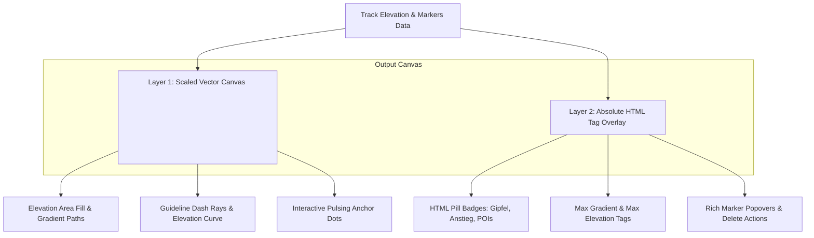

### Architectural Decision Record (ADR 005): Decoupled SVG Curve & HTML Tag Overlay
- **Context**: In SVG graphs with responsive resize listeners and dynamic coordinate transformations, rendering text labels inside `<g>` and `<text>` elements often results in optical stretching, subpixel blurring, or distorted aspect ratios when containers resize or change aspect ratios.
- **Decision**: Decouple the continuous vector elements (paths, fills, grid lines, anchor dots) from typographic elements (tags, badges, tooltips, popover cards). Render typography strictly in an absolute HTML overlay container positioned on top of the SVG canvas with pointer-event management.
- **Consequences**:
  - 100% crisp typography matching browser native anti-aliasing and subpixel font rendering.
  - Zero text distortion on arbitrary screen dimensions or window resize operations.
  - Full support for interactive HTML controls, truncated text chips, tooltips, and click-to-delete actions.

---

## 7. Map Camera View Synchronization & Control Event Isolation

To prevent race conditions during rapid map gestures (zoom in/out, pinch, scrollwheel, keyboard commands) while maintaining bidirectional state synchronization between React state and Leaflet / MapLibre instances, GPX Route Master employs an **isolated echo-suppressed synchronization loop**:

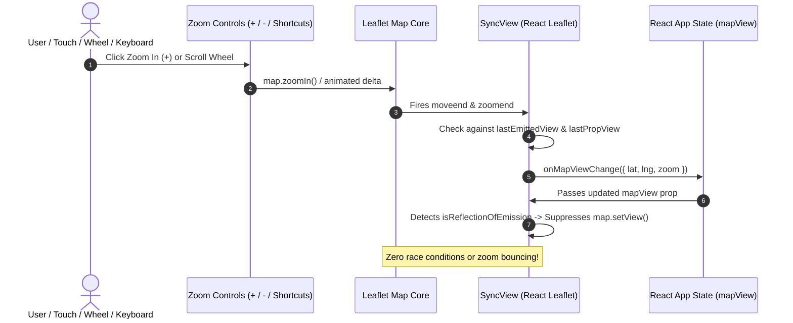

### Architectural Decision Record (ADR 006): Echo-Suppressed Map View Synchronization
- **Context**: In React applications managing external GIS map engines (Leaflet), binding camera coordinates (`center`, `zoom`) to reactive state while allowing interactive gestures often causes feedback loops. Unrelated state updates in parent components (such as point hovering or metric calculations) trigger component re-renders that reset in-progress zoom animations back to stale prop values.
- **Decision**: 
  1. Implement reference tracking (`lastEmittedView`, `lastPropView`) in `SyncView` to identify whether an incoming prop is an intentional external command (e.g., search or 3D/2D switch) or merely a reflection of the map's own recent user action.
  2. Isolate control container DOM events using `L.DomEvent.disableClickPropagation` and `L.DomEvent.disableScrollPropagation` to prevent map gestures from capturing button interactions.
  3. Register global keyboard zoom bindings (`+`, `-`, `=`) guarded against active input contexts.
- **Consequences**:
  - Smooth, immediate response to zoom in, zoom out, scroll wheel, and touch pinch gestures.
  - Zero jumpiness or cancellation of zoom animations during background state changes.

---

## 8. Startup Track Framing & Multi-Point Meteorological Pipeline

To ensure a seamless user experience upon loading activities and opening weather forecasts:

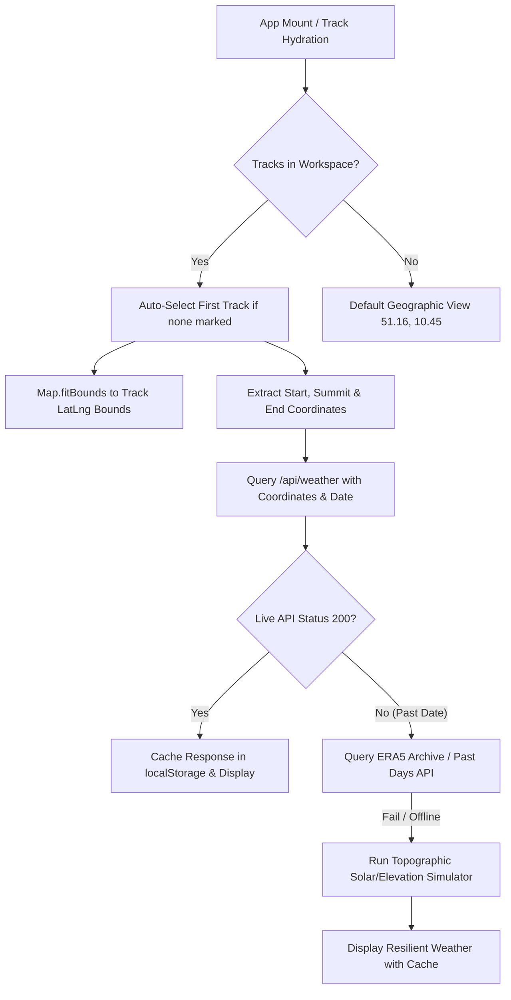

### Architectural Decision Record (ADR 007): Startup Track Auto-Framing & Resilient Multi-Point Route Weather
- **Context**: When the application loads tracks from workspace storage, the default camera coordinates (51.1657, 10.4515) leave the user viewing a wide country map instead of their actual route. Furthermore, weather queries previously relied only on the initial start coordinate, failing to account for alpine summit conditions or past activity timestamps.
- **Decision**:
  1. Automatically calculate the bounding box of the active or first loaded activity track on initial mount and trigger smooth `fitBounds` camera animation.
  2. Extract route-specific waypoints (**Startpunkt**, **Gipfel/Höchster Punkt** via maximum elevation tracking, and **Zielpunkt**).
  3. Support multi-tiered weather data sourcing: Open-Meteo live forecast, historical archive fallback for past activity recordings, and a deterministic topographic climate simulation model for offline usage.
  4. Provide quick date presets (*Heute*, *Morgen*, *Originalaktivität*) and compute apparent feels-like temperatures and sports-specific gear recommendations.
- **Consequences**:
  - Immediate, zero-effort framing of the user's route upon app launch.
  - Comprehensive, alpine-grade meteorological insights across critical ascent and valley sections of any route.
  - 100% offline resilience and instant rendering through localStorage caching.

---

## 9. Debounced Persistence & Modular State Lifecycle

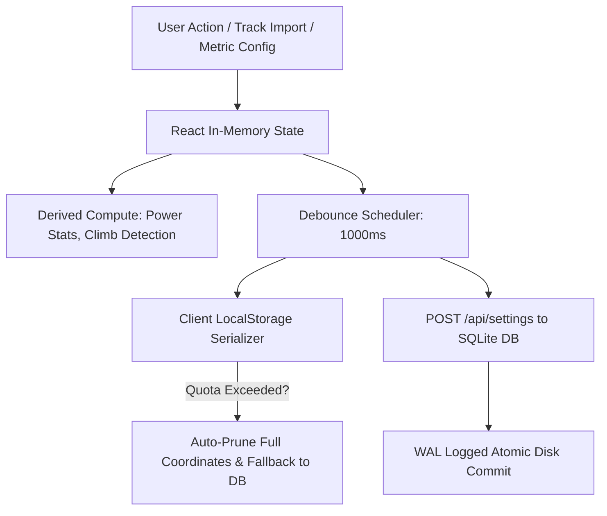

### Architectural Decision Record (ADR 008): Debounced Persistence & Modular State Management
- **Context**: Frequent user adjustments (FTP slider, user weight, target speed, marker creation) cause rapid state recalculations. Direct synchronous writes to disk/database or `localStorage` during active dragging cause UI micro-stutters and database locking.
- **Decision**:
  1. Implement a 1000ms debounce buffer on backend settings synchronization (`POST /api/settings`).
  2. Cache derived computations in memoized structures (`useMemo`, `useCallback`) to avoid redundant re-renders of the root map and elevation components.
  3. Include an auto-pruning fallback for `localStorage` when handling extremely large multi-megabyte GPX collections.
- **Consequences**:
  - Zero UI thread blocking during continuous slider adjustments.
  - Robust persistent state synchronized reliably between browser sessions and SQLite storage.

---

## 10. Mobile-First Responsive Layout & Standardized Touch Ergonomics

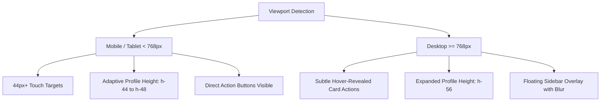

### Architectural Decision Record (ADR 009): Mobile-First Responsive Layout & Standardized Touch Ergonomics
- **Context**: On compact mobile screens (portrait smartphones), large fixed-height widgets reduce the usable map canvas to a small strip, and hover-only action buttons are inaccessible on touch interfaces without a mouse pointer.
- **Decision**:
  1. Make track card action buttons (visibility toggle, climbs, analytics, delete) visible by default on mobile devices while preserving clean hover transitions on desktop.
  2. Scale the bottom elevation profile container dynamically (`h-44 sm:h-48 md:h-56`) with fluid padding to maximize map area on mobile screens.
  3. Adhere to the minimum 44px touch target guidelines for interactive icons and navigation controls.
- **Consequences**:
  - First-class usability on mobile smartphones, tablets, and desktop workstations.
  - Seamless touch ergonomics with zero hidden interactive controls.

---

## 11. Leaflet Container ResizeObserver & Dynamic Bounds Synchronization

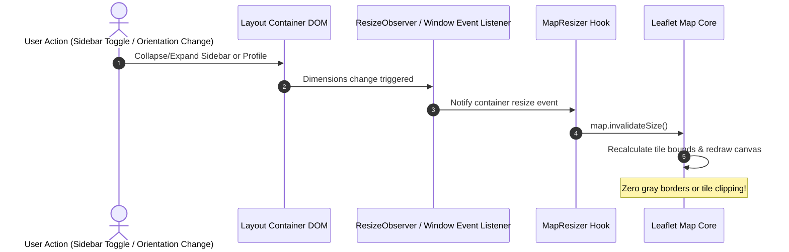

### Architectural Decision Record (ADR 010): Leaflet Container ResizeObserver & Dynamic Sizing Engine
- **Context**: CSS transitions (such as collapsing the elevation profile, opening the sidebar drawer, or rotating the mobile device) change the Leaflet map container's dimensions without firing a standard `window.resize` event, leading to unrendered gray areas or distorted tile layers.
- **Decision**:
  1. Attach a native `ResizeObserver` directly to `map.getContainer()` in the `MapResizer` component.
  2. Add `orientationchange` and `resize` window listeners with debounced execution.
  3. Debounce the elevation profile's SVG container measurements using `requestAnimationFrame` to eliminate layout thrashing.
- **Consequences**:
  - Instantaneous, jitter-free adaptation to sidebar toggles and mobile orientation changes.
  - Smooth 60 FPS animation during all UI state transitions.

---

## 12. React 19 Single-Instance Resolution & Hook Lifecycle Architecture

```mermaid
graph TD
    Vite[Vite Bundler / Dev Server] --> Dedupe[resolve.dedupe: 'react', 'react-dom']
    Dedupe --> ReactSingleton[Canonical React 19 Singleton Instance]
    
    ReactSingleton --> DOMRenderer[React DOM Renderer & Dispatcher]
    ReactSingleton --> DndKit[@dnd-kit sensors & sortable hooks]
    ReactSingleton --> LeafletBridge[react-leaflet map events & hooks]
    ReactSingleton --> Motion[motion/react animation controls]
    ReactSingleton --> Recharts[recharts telemetry visualizers]
    
    DOMRenderer -->|setDispatcher| Dispatcher[Active ReactCurrentDispatcher]
    Dispatcher --> HookCall[useState / useEffect / useMemo / useCallback]
    HookCall --> SmoothRender[Zero Invalid Hook Call Errors]
```

### Architectural Decision Record (ADR 011): React 19 Single-Instance Resolution & Hook Lifecycle Enforcement
- **Context**: In complex geospatial SPAs utilizing multiple ecosystem packages (`react-leaflet`, `@dnd-kit`, `recharts`, `motion`), module resolution can inadvertently link to dual React instances or invoke hooks outside of valid render phases, yielding `TypeError: can't access property "useState", resolveDispatcher() is null`.
- **Decision**:
  1. Enforce strict `resolve.dedupe: ['react', 'react-dom']` in Vite configuration to guarantee an unambiguous React singleton across all external and internal module imports.
  2. Maintain strict top-level hook declaration order inside functional components and prohibit late `useState` declarations after extensive effect blocks.
  3. Keep Leaflet and UI component tree boundaries wrapped in resilient `ErrorBoundary` fallbacks to catch transient mapping and canvas initialization exceptions gracefully without application halting.
- **Consequences**:
  - Completely eliminates `resolveDispatcher() is null` and duplicate React instance collisions.
  - Guarantees predictable hook execution order and state stability across all screen resolutions.

---

## 13. Foldable Workspace Track Cards & Progressive Disclosure Architecture

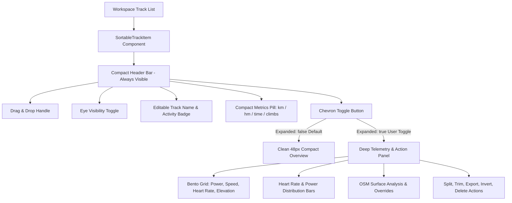

### Architectural Decision Record (ADR 012): Progressive Disclosure for Workspace Track Management
- **Context**: As users import multiple GPX/FIT activities (e.g. 5–20 multi-stage routes), rendering large expanded cards with bento grids, histograms, surface triggers, and action rows for every item caused severe vertical clutter, requiring excessive scrolling to locate and reorder routes.
- **Decision**:
  1. Adopt a progressive disclosure pattern where workspace track items are folded/collapsed by default.
  2. Maintain a compact summary bar displaying vital summary metrics (distance, ascent, duration, climb count) alongside essential quick-actions (visibility, drag-handle).
  3. Allow instant one-click unfolding via a chevron toggle to access detailed power stats, surface analysis, and segmentation tools.
- **Consequences**:
  - Maximizes vertical space and provides an uncluttered, high-level overview of multi-track collections.
  - Reduces DOM node complexity during re-ordering and dragging operations.
  - Gives users instant access to detailed telemetry when needed without cluttering the main workspace.

---

## 14. Automated Testing

All core calculation engines, downsampling algorithms, time-gap detectors, track manipulators, and responsive performance metrics are covered by unit tests:

```bash
# Run unit tests
npm test
```

Unit tests check:
- `calculateDistance()` precision and boundary conditions
- `simplifyTrackPoints()` start/end preservation and >75% point reduction on dense trails
- `getCachedSimplifiedPoints()` LRU memory cache reference identity and lookup speed
- `detectTimeGaps()` temporal gap detection and duration formatting
- `splitTrackAtIndex()` and `closeTimeGapInTrack()` track manipulation integrity
- `calculatePowerStats()` aerodynamic and rolling resistance physics calculations
- `findClimbs()` climb categorization and slope accuracy
- Responsive viewport bounding box expansion math

