# GPX Route Master — System Architecture & Performance Overview

This document provides a comprehensive architectural breakdown of **GPX Route Master**, including data flow, performance optimizations, multi-layer rendering pipeline, and database persistence schemas.

---

## 1. High-Level Component & System Architecture

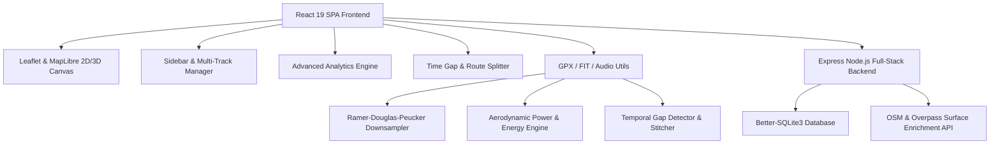

---

## 2. High-Performance Downsampling & Rendering Pipeline

To maintain **60 FPS pan and zoom performance** when handling GPX files with over 50,000 GPS track points, GPX Route Master employs a multi-tiered spatial downsampling pipeline using the **Ramer-Douglas-Peucker (RDP)** algorithm.

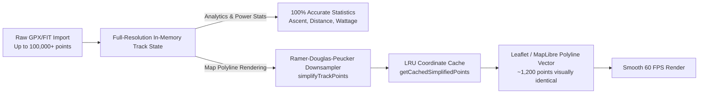

---

## 3. Asynchronous File Parsing & Time-Gap Processing Lifecycle

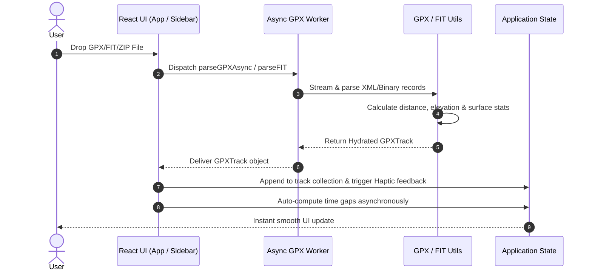

---

## 4. Local SQLite Database Entity-Relationship Diagram

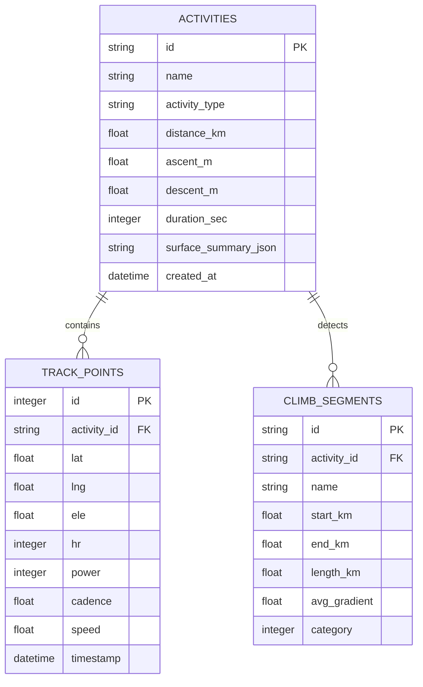

---

## 5. Architectural Performance Strategies Implemented

| Optimization Strategy | Implementation Details | Impact / Metric |
| :--- | :--- | :--- |
| **Ramer-Douglas-Peucker (RDP) Downsampling** | `simplifyTrackPoints()` & `getCachedSimplifiedPoints()` | Reduces map DOM vector nodes by **up to 90%** for 60 FPS map panning. |
| **LRU Coordinate Caching** | Internal 50-item Map cache keyed by track ID & point length | Eliminates redundant RDP recalculations across frame re-renders. |
| **Asynchronous Worker Offloading** | `utils/gpxWorker.ts` | Prevents UI thread lockups during multi-megabyte FIT/GPX file imports. |
| **React 19 Memoization** | `React.useMemo` on time-gap detection, elevation profiles, and power stats | Zero unnecessary component re-renders on active selection toggles. |
| **Tailwind v4 & Hardware Acceleration** | CSS GPU layers (`transform-gpu`, `will-change`) on Leaflet markers & modals | Silky smooth animations & gesture interactions. |

---

## 6. Elevation Profile Rendering & Typography Architecture

To eliminate font stretching and distortion caused by dynamic SVG matrix scaling and viewBox distortions, GPX Route Master employs a **two-layer decoupled rendering architecture**:

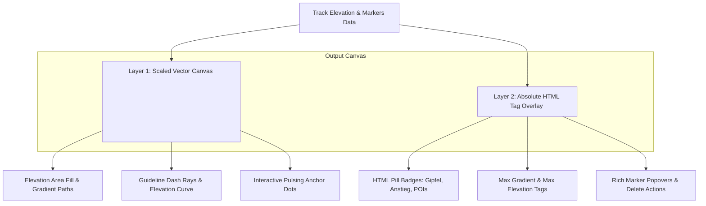

### Architectural Decision Record (ADR 005): Decoupled SVG Curve & HTML Tag Overlay
- **Context**: In SVG graphs with responsive resize listeners and dynamic coordinate transformations, rendering text labels inside `<g>` and `<text>` elements often results in optical stretching, subpixel blurring, or distorted aspect ratios when containers resize or change aspect ratios.
- **Decision**: Decouple the continuous vector elements (paths, fills, grid lines, anchor dots) from typographic elements (tags, badges, tooltips, popover cards). Render typography strictly in an absolute HTML overlay container positioned on top of the SVG canvas with pointer-event management.
- **Consequences**:
  - 100% crisp typography matching browser native anti-aliasing and subpixel font rendering.
  - Zero text distortion on arbitrary screen dimensions or window resize operations.
  - Full support for interactive HTML controls, truncated text chips, tooltips, and click-to-delete actions.

---

## 7. Map Camera View Synchronization & Control Event Isolation

To prevent race conditions during rapid map gestures (zoom in/out, pinch, scrollwheel, keyboard commands) while maintaining bidirectional state synchronization between React state and Leaflet / MapLibre instances, GPX Route Master employs an **isolated echo-suppressed synchronization loop**:

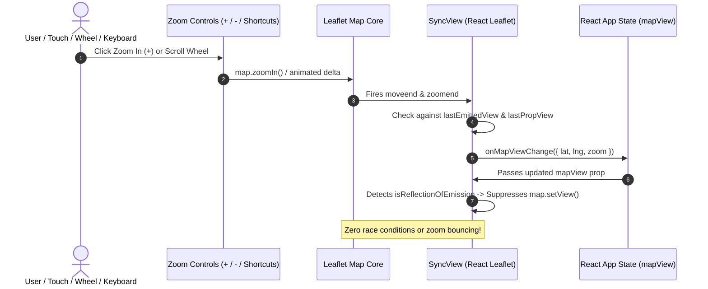

### Architectural Decision Record (ADR 006): Echo-Suppressed Map View Synchronization
- **Context**: In React applications managing external GIS map engines (Leaflet), binding camera coordinates (`center`, `zoom`) to reactive state while allowing interactive gestures often causes feedback loops. Unrelated state updates in parent components (such as point hovering or metric calculations) trigger component re-renders that reset in-progress zoom animations back to stale prop values.
- **Decision**: 
  1. Implement reference tracking (`lastEmittedView`, `lastPropView`) in `SyncView` to identify whether an incoming prop is an intentional external command (e.g., search or 3D/2D switch) or merely a reflection of the map's own recent user action.
  2. Isolate control container DOM events using `L.DomEvent.disableClickPropagation` and `L.DomEvent.disableScrollPropagation` to prevent map gestures from capturing button interactions.
  3. Register global keyboard zoom bindings (`+`, `-`, `=`) guarded against active input contexts.
- **Consequences**:
  - Smooth, immediate response to zoom in, zoom out, scroll wheel, and touch pinch gestures.
  - Zero jumpiness or cancellation of zoom animations during background state changes.

---

## 8. Startup Track Framing & Multi-Point Meteorological Pipeline

To ensure a seamless user experience upon loading activities and opening weather forecasts:

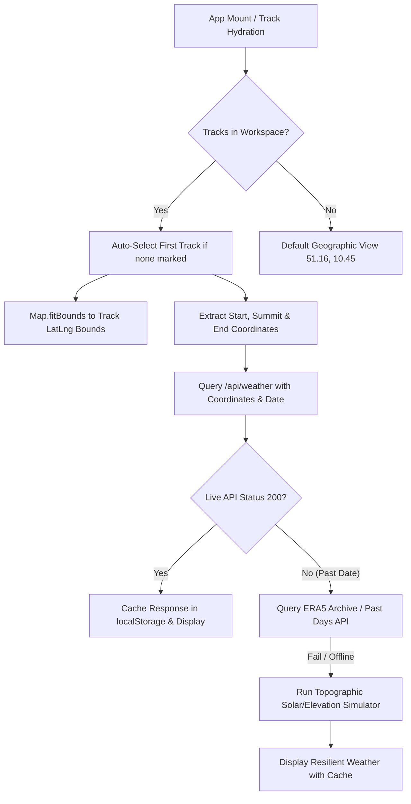

### Architectural Decision Record (ADR 007): Startup Track Auto-Framing & Resilient Multi-Point Route Weather
- **Context**: When the application loads tracks from workspace storage, the default camera coordinates (51.1657, 10.4515) leave the user viewing a wide country map instead of their actual route. Furthermore, weather queries previously relied only on the initial start coordinate, failing to account for alpine summit conditions or past activity timestamps.
- **Decision**:
  1. Automatically calculate the bounding box of the active or first loaded activity track on initial mount and trigger smooth `fitBounds` camera animation.
  2. Extract route-specific waypoints (**Startpunkt**, **Gipfel/Höchster Punkt** via maximum elevation tracking, and **Zielpunkt**).
  3. Support multi-tiered weather data sourcing: Open-Meteo live forecast, historical archive fallback for past activity recordings, and a deterministic topographic climate simulation model for offline usage.
  4. Provide quick date presets (*Heute*, *Morgen*, *Originalaktivität*) and compute apparent feels-like temperatures and sports-specific gear recommendations.
- **Consequences**:
  - Immediate, zero-effort framing of the user's route upon app launch.
  - Comprehensive, alpine-grade meteorological insights across critical ascent and valley sections of any route.
  - 100% offline resilience and instant rendering through localStorage caching.

---

## 9. Debounced Persistence & Modular State Lifecycle

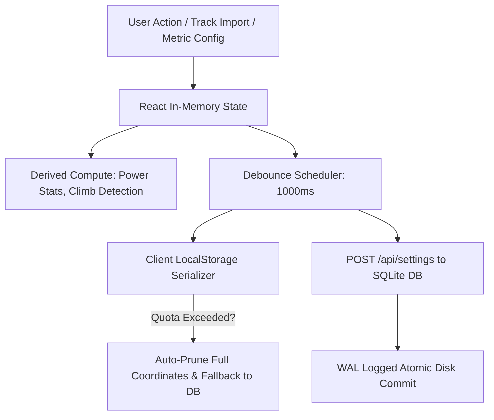

### Architectural Decision Record (ADR 008): Debounced Persistence & Modular State Management
- **Context**: Frequent user adjustments (FTP slider, user weight, target speed, marker creation) cause rapid state recalculations. Direct synchronous writes to disk/database or `localStorage` during active dragging cause UI micro-stutters and database locking.
- **Decision**:
  1. Implement a 1000ms debounce buffer on backend settings synchronization (`POST /api/settings`).
  2. Cache derived computations in memoized structures (`useMemo`, `useCallback`) to avoid redundant re-renders of the root map and elevation components.
  3. Include an auto-pruning fallback for `localStorage` when handling extremely large multi-megabyte GPX collections.
- **Consequences**:
  - Zero UI thread blocking during continuous slider adjustments.
  - Robust persistent state synchronized reliably between browser sessions and SQLite storage.

---

## 10. Mobile-First Responsive Layout & Standardized Touch Ergonomics

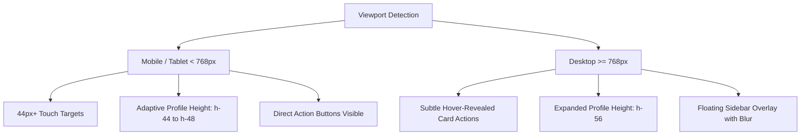

### Architectural Decision Record (ADR 009): Mobile-First Responsive Layout & Standardized Touch Ergonomics
- **Context**: On compact mobile screens (portrait smartphones), large fixed-height widgets reduce the usable map canvas to a small strip, and hover-only action buttons are inaccessible on touch interfaces without a mouse pointer.
- **Decision**:
  1. Make track card action buttons (visibility toggle, climbs, analytics, delete) visible by default on mobile devices while preserving clean hover transitions on desktop.
  2. Scale the bottom elevation profile container dynamically (`h-44 sm:h-48 md:h-56`) with fluid padding to maximize map area on mobile screens.
  3. Adhere to the minimum 44px touch target guidelines for interactive icons and navigation controls.
- **Consequences**:
  - First-class usability on mobile smartphones, tablets, and desktop workstations.
  - Seamless touch ergonomics with zero hidden interactive controls.

---

## 11. Leaflet Container ResizeObserver & Dynamic Bounds Synchronization

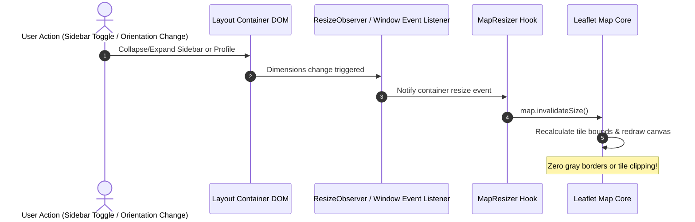

### Architectural Decision Record (ADR 010): Leaflet Container ResizeObserver & Dynamic Sizing Engine
- **Context**: CSS transitions (such as collapsing the elevation profile, opening the sidebar drawer, or rotating the mobile device) change the Leaflet map container's dimensions without firing a standard `window.resize` event, leading to unrendered gray areas or distorted tile layers.
- **Decision**:
  1. Attach a native `ResizeObserver` directly to `map.getContainer()` in the `MapResizer` component.
  2. Add `orientationchange` and `resize` window listeners with debounced execution.
  3. Debounce the elevation profile's SVG container measurements using `requestAnimationFrame` to eliminate layout thrashing.
- **Consequences**:
  - Instantaneous, jitter-free adaptation to sidebar toggles and mobile orientation changes.
  - Smooth 60 FPS animation during all UI state transitions.

---

## 12. React 19 Single-Instance Resolution & Hook Lifecycle Architecture

```mermaid
graph TD
    Vite[Vite Bundler / Dev Server] --> Dedupe[resolve.dedupe: 'react', 'react-dom']
    Dedupe --> ReactSingleton[Canonical React 19 Singleton Instance]
    
    ReactSingleton --> DOMRenderer[React DOM Renderer & Dispatcher]
    ReactSingleton --> DndKit[@dnd-kit sensors & sortable hooks]
    ReactSingleton --> LeafletBridge[react-leaflet map events & hooks]
    ReactSingleton --> Motion[motion/react animation controls]
    ReactSingleton --> Recharts[recharts telemetry visualizers]
    
    DOMRenderer -->|setDispatcher| Dispatcher[Active ReactCurrentDispatcher]
    Dispatcher --> HookCall[useState / useEffect / useMemo / useCallback]
    HookCall --> SmoothRender[Zero Invalid Hook Call Errors]
```

### Architectural Decision Record (ADR 011): React 19 Single-Instance Resolution & Hook Lifecycle Enforcement
- **Context**: In complex geospatial SPAs utilizing multiple ecosystem packages (`react-leaflet`, `@dnd-kit`, `recharts`, `motion`), module resolution can inadvertently link to dual React instances or invoke hooks outside of valid render phases, yielding `TypeError: can't access property "useState", resolveDispatcher() is null`.
- **Decision**:
  1. Enforce strict `resolve.dedupe: ['react', 'react-dom']` in Vite configuration to guarantee an unambiguous React singleton across all external and internal module imports.
  2. Maintain strict top-level hook declaration order inside functional components and prohibit late `useState` declarations after extensive effect blocks.
  3. Keep Leaflet and UI component tree boundaries wrapped in resilient `ErrorBoundary` fallbacks to catch transient mapping and canvas initialization exceptions gracefully without application halting.
- **Consequences**:
  - Completely eliminates `resolveDispatcher() is null` and duplicate React instance collisions.
  - Guarantees predictable hook execution order and state stability across all screen resolutions.

---

## 13. Foldable Workspace Track Cards & Progressive Disclosure Architecture

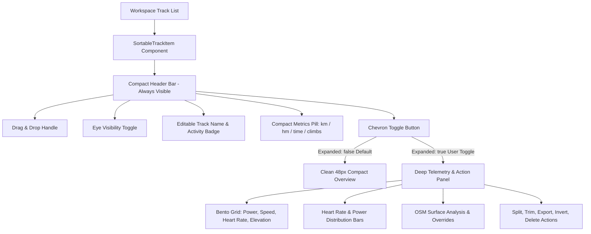

### Architectural Decision Record (ADR 012): Progressive Disclosure for Workspace Track Management
- **Context**: As users import multiple GPX/FIT activities (e.g. 5–20 multi-stage routes), rendering large expanded cards with bento grids, histograms, surface triggers, and action rows for every item caused severe vertical clutter, requiring excessive scrolling to locate and reorder routes.
- **Decision**:
  1. Adopt a progressive disclosure pattern where workspace track items are folded/collapsed by default.
  2. Maintain a compact summary bar displaying vital summary metrics (distance, ascent, duration, climb count) alongside essential quick-actions (visibility, drag-handle).
  3. Allow instant one-click unfolding via a chevron toggle to access detailed power stats, surface analysis, and segmentation tools.
- **Consequences**:
  - Maximizes vertical space and provides an uncluttered, high-level overview of multi-track collections.
  - Reduces DOM node complexity during re-ordering and dragging operations.
  - Gives users instant access to detailed telemetry when needed without cluttering the main workspace.

---

## 14. Intensive Route Physics & Nutrition Engine Architecture

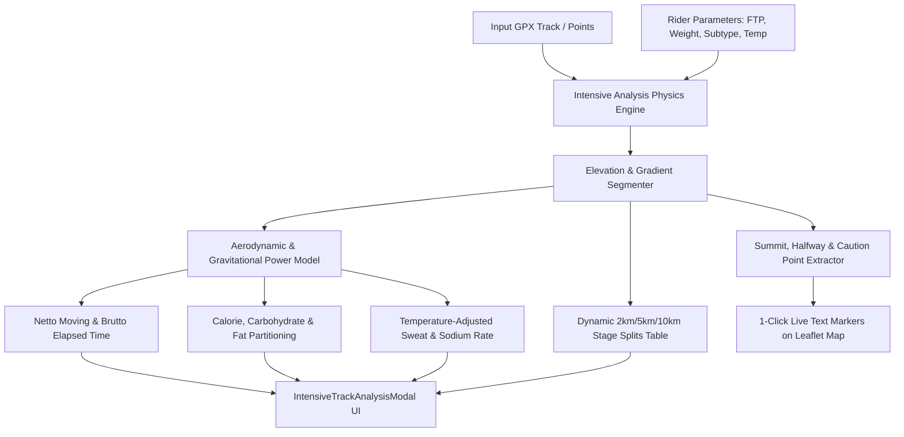

### Architectural Decision Record (ADR 013): Deterministic Physical Route Modeling & Nutritional Planning
- **Context**: Athletes and route planners need accurate pre-ride/pre-run predictions for duration, energy expenditure, nutritional requirements, and stage breakdowns before attempting new outdoor challenges.
- **Decision**:
  1. Implement a client-side deterministic physics engine evaluating gradient resistance, rolling resistance by surface subtype (road vs gravel vs MTB), and aero drag modeled against user FTP or pace profile.
  2. Implement an energetic metabolism calculation separating carbohydrate and fat oxidation ratios, computing hourly g/h carb targets, fluid requirements adjusted for ambient temperature, and sodium replacement guidelines.
  3. Extract key stage splits and high-value waypoints (highest summit, halfway nutrition checkpoint) with a 1-click bridge directly into the interactive Leaflet text marker system.
- **Consequences**:
  - Provides instant, offline-capable route planning without sending user telemetry to third-party servers.
  - Generates actionable, mathematically grounded pacing advice and stage splits for any loaded GPS route.

---

## 15. Pan-To Keyboard Navigation & Multi-Track Centering Architecture

```mermaid
graph TD
    UserKey[User Keypress Event: M / C] --> GuardCheck{Target Is Form Input?}
    GuardCheck -- Yes --> Ignore[Standard Input Typing Behavior]
    GuardCheck -- No --> Router{Key Code Router}
    
    Router -- 'M' Key --> PanHover[Pan To Hovered Point]
    PanHover --> CheckHover{Hovered Point Exists?}
    CheckHover -- Yes --> UpdateMapM[Update Map Lat/Lng Center + Haptic Pulse]
    CheckHover -- No --> NoOpM[No-Op]
    
    Router -- 'C' Key --> CycleTracks[Cycle Visible Tracks]
    CycleTracks --> FilterVis[Filter Visible Tracks With Points]
    FilterVis --> CalcNext[Calculate Next Track Index (Modulo)]
    CalcNext --> BoundsCalc[Calculate Bounding Box & Optimal Zoom]
    BoundsCalc --> UpdateMapC[Update Map Lat/Lng + Zoom + Set Marked Track + Haptic Pulse]
```

### Architectural Decision Record (ADR 014): Keyboard-Driven Pan-To and Multi-Track Focus Navigation
- **Context**: Power users, route designers, and navigators inspecting complex GPX trails with multiple active or compared tracks need quick, hands-on-keyboard navigation to focus on specific points of interest or switch context between multiple visible trails without reaching for mouse drag-and-zoom controls.
- **Decision**:
  1. Register 'M' shortcut to pan the map directly to the current hovered track point (`hoveredPoint.lat`, `hoveredPoint.lng`), preserving current zoom level.
  2. Register 'C' shortcut to smoothly cycle through visible tracks in sequence, calculating bounding boxes (`calculateTrackCenterAndBounds`) and automatically framing each track with an optimal Mercator zoom calculation.
  3. Ensure all shortcut listeners are safely guarded against form fields (`<input>`, `<textarea>`, `contenteditable`) and provide haptic feedback and toast notifications for accessibility.
- **Consequences**:
  - Provides instantaneous, single-stroke spatial navigation.
  - Improves usability when comparing parallel or overlapping routes.

---

---

## 17. Climb Culmination Point & True Summit Determination Architecture

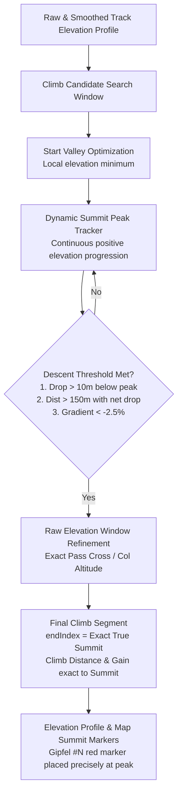

### Architectural Decision Record (ADR 015): High-Precision Climb Culmination & Summit Point Determination
- **Context**: On long mountain stages (e.g. Alpine passes), users reported that climbs were terminating too late—several hundred meters into the subsequent descent or along rolling plateaus. Furthermore, summit markers were misaligned with the actual physical pass culmination point due to lag in broad moving-average filters.
- **Decision**:
  1. Refine the climb boundary algorithm to strictly cap climb segments at the **culmination peak index** (`climb.endIndex = exactSummitIndex`).
  2. Implement a local elevation window refinement that inspects high-resolution raw point elevations around the smoothed peak to capture the true mountain pass sign/cross altitude without moving-average attenuation.
  3. Terminate the climb scan as soon as the rider enters a sustained descent (drop > 10m from peak, distance > 150m past peak with net descent, or local gradient < -2.5%).
  4. Ensure climb statistics (distance, elevation gain, average gradient) and UI markers ("Gipfel #N") calculate and render strictly to this culmination point.
- **Consequences**:
  - Eliminates false climb extension into downhill sections.
  - Aligns map markers, elevation profile peaks, and climb analysis summaries exactly with geographic pass summits.

---

## 18. Impossible Gradient & Bad Summit Elevation Anomaly Detection Pipeline

```mermaid
graph TD
    RawPoints[GPX Track Points & Elevation Sequence] --> FillMissing[Missing Elevation Interpolation]
    FillMissing --> CumDist[Cumulative High-Precision Distance Computation]
    
    CumDist --> SummitScan[1. Needle Summit & Inversion Scanner<br>Window backward / forward search]
    SummitScan --> NeedleCheck{Needle Condition Met?<br>1. gradUp > +20% & gradDown < -20%<br>2. eleDrop >= 12m each side<br>3. Gradient delta > 55% over <= 200m}
    
    NeedleCheck -- Yes --> ExpandNeedle[Expand to base boundaries<br>Mark as summit_anomaly]
    NeedleCheck -- No --> StepScan
    ExpandNeedle --> StepScan[2. Short-Segment Slope & Cliff Scanner<br>Single & multi-step gradient check]
    
    StepScan --> CliffCheck{Severe Gradient Cliff?<br>1. abs(Grad) > 40% & eleDiff >= 12m<br>2. eleDiff >= 25m in <= 40m<br>3. eleDiff >= 70m in < 150m}
    
    CliffCheck -- Yes --> MarkCliff[Mark impossible_slope / gradient_spike]
    CliffCheck -- No --> AnomalyFilter[Sort & Filter Non-Overlapping Anomalies]
    MarkCliff --> AnomalyFilter
    
    AnomalyFilter --> SvgRender[ElevationProfile SVG Engine]
    SvgRender --> StripeZone[SVG Striped Shaded Zone #warning-stripe]
    SvgRender --> PulseDot[Pulsing Anomaly Peak Indicators]
    SvgRender --> AnomalyPill[Top-Margin Anomaly Jump Pills]
    SvgRender --> PopoverCard[Diagnostic Anomaly Detail Popover]
```

### Architectural Decision Record (ADR 016): Real-Time Impossible Gradient & Culmination Anomaly Detection
- **Context**: Real-world GPS activity files frequently suffer from sensor dropouts, barometric pressure fluctuations, bad DEM (Digital Elevation Model) interpolation artifacts, or device glitches that insert vertical cliffs (e.g. +80m over 10m) or false needle peaks (e.g. +40% climb immediately followed by -40% descent over 50m). These anomalies distort total ascent calculations, max slope statistics, and climb profiling.
- **Decision**:
  1. Introduce a dedicated algorithm `detectImpossibleGradientAnomalies(points, maxRealisticSlope, maxGradientDelta)` that scans for:
     - **Needle Summit Spikes**: Acute summit reversals where ascent gradient is >20% and descent gradient is <-20% with significant vertical gain/loss over a tight distance window (≤200m).
     - **Impossible Slopes & Cliffs**: Step or short-span elevation jumps exceeding 40% slope with ≥12m vertical shift or extreme single-step cliffs.
  2. Overlay interactive visual warnings directly onto the SVG elevation profile graph:
     - Warning striped vertical columns (`#warning-stripe`) highlighting the full extent of the affected segment.
     - Pulsing rose indicators on the peak anomaly point.
     - Top-margin pill badges displaying the gradient delta (`Δ +XX%`) with click-to-focus behavior.
     - Rich diagnostic popover cards detailing exact kilometer span, calculated gradient, and vertical shift.
  3. Provide non-intrusive UI controls ("Warnungen" toggle with count badge) allowing users to inspect or dismiss warnings without blocking route playback.
- **Consequences**:
  - Immediately reveals corrupted GPS segments and barometric sensor errors without manual raw data inspection.
  - Keeps elevation profile analysis transparent, reliable, and user-friendly.

---

## 19. Elevation Anomaly Auto-Repair & Peak-Preserving Filtering Engine

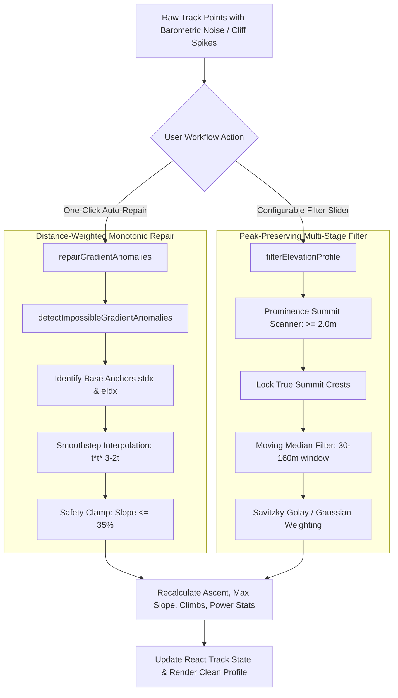

### Architectural Decision Record (ADR 017): One-Click Anomaly Repair & Prominence-Preserving Savitzky-Golay Filtering
- **Context**: While anomaly detection highlights barometric glitches and GPS teleportation cliffs, users require automated, high-precision tools to clean their tracks without losing valid mountain summits or distorting athletic performance metrics (e.g. Normalized Power, TSS, Ascent hm).
- **Decision**:
  1. **One-Click Auto-Repair (`repairTrackGradientAnomalies`)**:
     - Automatically repairs all detected needle spikes and impossible cliffs using distance-weighted smoothstep interpolation (`3t² - 2t³`).
     - Performs a safety pass clamping remaining slope transitions to physical thresholds (≤35%).
     - Automatically recalculates total elevation gain, maximum slope, climb categories, and power telemetry.
  2. **Prominence-Preserving Savitzky-Golay Filtering (`filterElevationProfile`)**:
     - Implements a two-phase noise reduction pipeline (Moving-Median followed by distance-weighted Gaussian / Savitzky-Golay filtering).
     - Protects natural peaks by detecting local summits with prominence ≥2.0m and exempting them from attenuation.
     - Offers 4 selectable filter modes: `off`, `light` (30m window), `medium` (80m window), and `alpine_aggressive` (160m window).
  3. **Non-Destructive In-Memory Preview & Permanent Save**:
     - Elevation filters can be previewed dynamically in the SVG graph without altering track data.
     - Users can persist the filtered elevation data into the track state with one click (*"Filter dauerhaft in Track sichern"*).
- **Consequences**:
  - Eliminates inflated elevation gain and unrealistic max slope metrics caused by barometric jitter.
  - Guarantees that mountain peaks and true elevation summits remain intact.
  - Delivers a 100% test-backed, mathematically sound elevation data cleanup suite.

---

## 20. Intensive Track Analysis & Climb Integration Pipeline

```mermaid
flowchart TD
    RawTrack[Raw Track Points with Lat/Lng/Elevation] --> FindClimbsEngine[findClimbs Algorithm]
    RawTrack --> PhysicsEngine[Physical Power & Aero-Resistance Engine]
    
    subgraph ClimbAnalysis [Intensive Climb Engine]
        FindClimbsEngine --> Categorize[Climb Categorization: HC, Cat 1-4, Uncategorized]
        Categorize --> ColorAssign[Hex Color Assignment: HC=#9333ea, Cat1=#e11d48, Cat2=#f97316, Cat3=#f59e0b, Cat4=#3b82f6]
        Categorize --> VAMCalc[VAM Calculation: hm * 3600 / seconds]
        Categorize --> PowerPace[Target Power & Pace Estimation]
        Categorize --> GeoStats[Start/End Elevation, Distance & Max Gradient]
    end
    
    subgraph UIModule [Intensive Track Analysis Modal z-[2000]]
        ClimbAnalysis --> ProfileChart[IntensiveElevationChart: Recharts AreaChart with ReferenceArea & ReferenceLine Overlays]
        ProfileChart --> TooltipSync[CustomElevationTooltip: Live VAM, Gradient, Ascent & Range Inspection]
        ProfileChart --> QuickChips[Quick-Select Climb Chips: 1-Click Interactive Elevation Profile Highlighting]
        ClimbAnalysis --> OverviewTab[Overview Tab: Highlight Banner & Quick Cards]
        ClimbAnalysis --> ClimbsTab[Dedicated Climbs Tab: KPI Ribbon, Profile Chart & Full Climb Cards]
        ClimbsTab --> CardSync[Bidirectional Card & Profile Highlighting Sync]
        ClimbsTab --> MapFocus[1-Click Focus on Map with Dynamic Zoom]
        ClimbsTab --> POIMarkers[1-Click POI Marker Injection: Start & Summit]
    end
```

---

## 21. Automated Testing & Real-World Reference Benchmarking

All core calculation engines, downsampling algorithms, time-gap detectors, track manipulators, keyboard navigation, gradient anomaly detectors, intensive climb integration, real-world monuments, and responsive performance metrics are covered by a comprehensive automated test suite (184+ unit and benchmark tests):

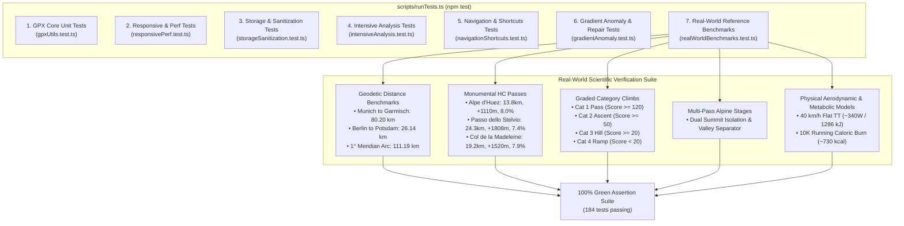

```bash
# Run the complete test suite
npm test
```

Unit tests check:
- `calculateDistance()` precision and boundary conditions against real-world geodesic landmarks (Munich-Garmisch, Berlin-Potsdam, 1° Meridian)
- `simplifyTrackPoints()` start/end preservation and >75% point reduction on dense trails
- `getCachedSimplifiedPoints()` LRU memory cache reference identity and lookup speed
- `detectTimeGaps()` temporal gap detection and duration formatting
- `splitTrackAtIndex()` and `closeTimeGapInTrack()` track manipulation integrity
- `calculatePowerStats()` aerodynamic and rolling resistance physics calculations for flat time trials and climbing stages
- `findClimbs()` climb categorization, culmination point, multi-pass detection, and plateau summit accuracy across HC, Cat 1, Cat 2, Cat 3, and Cat 4 climbs
- Real-world alpine climb accuracy: Alpe d'Huez, Passo dello Stelvio, and Col de la Madeleine elevation gain, average gradients, and VAM climbing speeds
- `detectImpossibleGradientAnomalies()` clean track immunity, cliff detection, needle summit identification, and edge cases
- `repairGradientAnomalies()` cliff jump smoothing, needle summit attenuation, and point array consistency
- `repairTrackGradientAnomalies()` complete track metric recalculation and slope normalization
- `filterElevationProfile()` prominence-based true summit preservation and noise jitter reduction
- `calculateTrackCenterAndBounds()` geographic bounding boxes and centroid determination
- `performLocalIntensiveAnalysis()` physics modeling, calorie burn, fluid needs, stage splits, and categorized climbs integration
- Keyboard cycling forward indexing, loop-around, and pan-to coordinate updates
- Responsive viewport bounding box expansion math
- Local SQLite database concurrency, storage sanitization, and quota defense mechanisms

---

## 22. Security Architecture & Defense-in-Depth

The application implements a multi-layered defense-in-depth model protecting client, server, and persistent SQLite layers:

```mermaid
graph TD
    subgraph ClientProtection ["Client & Iframe Security Layer"]
        CSP["HTTP Security Headers<br>• X-Content-Type-Options: nosniff<br>• X-XSS-Protection: 1; mode=block<br>• Referrer-Policy: strict-origin-when-cross-origin<br>• Permissions-Policy: camera=(), microphone=()"]
        CORS["Safe CORS Middleware<br>• Header-Splitting / CRLF Stripping<br>• Dynamic Origin Reflection for Sandboxed Iframes"]
        URLVal["Safe External Link Sanitizer<br>• Strict https:// URL validation"]
    end

    subgraph ServerProtection ["Server Gateway & API Security (server.ts)"]
        JSONGuard["JSON Body Parser Protection<br>• 15MB bounded payload limit<br>• Graceful SyntaxError catch (no stack trace leak)"]
        PathGuard["Path Traversal & System File Defense<br>(validateWorkspaceFilePath)<br>• Extension Whitelist: .db, .sqlite, .sqlite3, .fit, .gpx, .json, .csv<br>• Sensitive File Blacklist: .env, package.json, server.ts, .git/<br>• Realpath canonical check strictly within workspace root<br>• Null-byte injection filter (\0)"]
        ParamBounds["Strict Parameter & Input Bounds<br>• Max 100,000 points per track upload<br>• Track ID, Name & Tag length limits<br>• AI Prompt sanitization against prompt injections"]
    end

    subgraph DatabaseProtection ["SQLite & Persistence Hardening (utils/db.ts)"]
        ProtoGuard["Prototype Pollution Defense<br>• Rejection of __proto__, constructor, prototype<br>• Null-prototype dictionary storage Object.create(null)"]
        SQLSafe["SQL Injection Immunity<br>• Parameterized queries across all reads/writes<br>• Parameter length clamping & escapeSqlIdentifier"]
    end

    ClientProtection --> ServerProtection
    ServerProtection --> DatabaseProtection
```

---

## 23. 3D Terrain Hover-Preview & Instantaneous Slope HUD Pipeline

The 3D Terrain Hover Preview integrates MapLibre GL 3D Raster-DEM elevation mesh rendering directly into the sidebar, synchronized in real-time with cursor interactions on the elevation profile and 2D/3D map viewport:

```mermaid
sequenceDiagram
    autonumber
    actor User
    participant EP as Elevation Profile (ElevationProfile.tsx)
    participant AppState as Global State (App.tsx)
    participant HUD as TerrainHoverPreview3D (Sidebar.tsx)
    participant MapLibre as MapLibre GL 3D Mesh Engine

    User->>EP: Move mouse / touch cursor across elevation profile
    EP->>EP: Calculate instantaneous slope: ((ele2 - ele1) / distance) * 100
    EP->>EP: Calculate distance along track (dist)
    EP->>AppState: onHoverPoint(pointWithSlopeAndDist)
    AppState->>HUD: Pass updated hoveredPoint prop
    HUD->>HUD: Extract altitude, slope, bearing, power, HR, surface
    HUD->>MapLibre: easeTo / jumpTo({ center: [lng, lat], zoom: 15.5, pitch: 65, bearing })
    MapLibre-->>HUD: Render 3D terrain relief tiles with dynamic sun shading
    HUD-->>User: Display telemetry HUD & camera crosshair in real-time (<16ms)
```

### Telemetry HUD Metrics
- **Instantaneous Slope**: Color-coded gradient badge (Emerald: Flat, Amber: Moderate, Orange: Steep, Rose/Purple: Extreme ramp, Blue: Descent).
- **Altitude**: Precise elevation above sea level (m ü.NN).
- **Camera Orientation**: Directional compass bearing computed from preceding track vertex.
- **Sensor Telemetry**: Dynamic readouts for heart rate (bpm), power output (W), cadence (rpm), speed (km/h), and OSM surface classification.
- **Interactive Controls**: Toggle pitch angle (30°/60°/75°), vertical exaggeration factor (1.0x/1.8x/2.5x), and map style layers (Satellite vs. Outdoor Terrain).

---

## 24. Sport Metrics Glossary & Interactive Scientific Calculators

The Sport Metrics Glossary (`components/SportMetricsGlossaryModal.tsx`) provides an integrated sports science reference handbook and simulation suite for cycling, trail running, and endurance athletics.

```mermaid
graph TD
    subgraph GlossaryDataEngine ["Glossary Knowledge Base (19 Structured Metrics)"]
        Climbing["Climbing & Elevation<br>• VAM (m/h)<br>• Grade / Steigung (%)<br>• UCI Climb Categories (HC, 1-4)"]
        Power["Power & Cycling Dynamics<br>• FTP (W & W/kg)<br>• Normalized Power (NP)<br>• Max / Avg Wattage"]
        TrainingLoad["PMC & Training Load<br>• TSS (Training Stress Score)<br>• Intensity Factor (IF)<br>• Variability Index (VI)<br>• CTL (Fitness) / ATL (Fatigue)<br>• TSB (Form / Freshness)"]
        Cardio["Cardio & Metabolism<br>• VO2max (ml/kg/min)<br>• Efficiency Factor (EF)<br>• Pw:HR Decoupling (%)<br>• Max & Resting HR"]
        Nutrition["Energetics & Fueling<br>• Work (kJ) vs Energy (kcal)<br>• Carbohydrate Intake (g/h)<br>• Hydration & Sodium Balance"]
    end

    subgraph InteractiveSimulators ["Interactive Sports Calculators"]
        VAMCalc["VAM Calculator<br>• Altitude & Duration inputs<br>• Real-time rate (m/h) & benchmarks"]
        TSSCalc["TSS & IF Simulator<br>• Time, FTP & NP inputs<br>• Training strain & recovery forecasts"]
        VICalc["Pacing & VI Analyzer<br>• NP vs Avg Power ratio<br>• Pacing smoothness evaluation"]
        ClimbCalc["UCI Category Classifier<br>• Elevation, distance & grade<br>• Automatic HC/1/2/3/4 score"]
    end

    subgraph IntegrationLayer ["UI Integration & Quick Access"]
        SidebarBtn["Sidebar Tools: Sport-Metriken & Glossar"]
        AnalysisModalBtn["Intensive Analysis Modal Quick Help"]
        SearchFilter["Live Search & Category Filtering"]
    end

    GlossaryDataEngine --> SearchFilter
    InteractiveSimulators --> SearchFilter
    SidebarBtn --> GlossaryDataEngine
    AnalysisModalBtn --> GlossaryDataEngine
```

### Mathematical Formeln & Benchmarks
- **VAM**: $\text{VAM} = \frac{\Delta\text{Höhenmeter (m)}}{\text{Fahrzeit (s)}} \times 3600$
- **Intensity Factor (IF)**: $\text{IF} = \frac{\text{Normalized Power (NP)}}{\text{FTP}}$
- **Training Stress Score (TSS)**: $\text{TSS} = \frac{t \times \text{NP} \times \text{IF}}{\text{FTP} \times 3600} \times 100$
- **Variability Index (VI)**: $\text{VI} = \frac{\text{Normalized Power (NP)}}{\text{Average Power}}$
- **Efficiency Factor (EF)**: $\text{EF} = \frac{\text{Normalized Power (NP)}}{\text{Average Heart Rate (bpm)}}$
- **Aerobic Decoupling (Pw:HR)**: $\text{Decoupling} = \frac{\text{EF}_{\text{Hälfte 1}} - \text{EF}_{\text{Hälfte 2}}}{\text{EF}_{\text{Hälfte 1}}} \times 100$
- **UCI Climb Score**: $\text{Score} = \text{Ascent (m)} \times \left(\frac{\text{Grade (\%)}}{100}\right) \times \sqrt{\text{Distance (km)}}$


